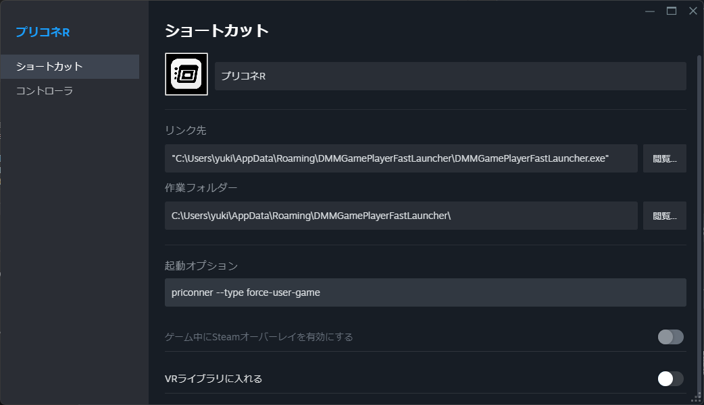

# DMMGamePlayerFastLauncher

## 詳しい使い方

[日本語](/README.md) / [English](/README-en.md)

> [!WARNING]
> うまくインストール出来ない場合は、ウイルス対策ソフトやWindows Defenderで検知されている可能性があります。
> 一時的に無効化して再度インストールを試みてください。

> [!NOTE]
> DMMGamePlayer がすでにインストールされている必要があります。
> <https://player.games.dmm.com/>

### 簡単な使用法

1. DMMGamePlayerFastLauncherを起動します。
2. `ショートカット` 内の `ショートカットの作成` を開きます。
3. `ファイル名` は適当な名前を入力します。
4. `product_idの選択` は高速起動したいゲームのIDを選択します。
5. `アカウントの選択` は `常にDMMから抽出する` を選択します。
6. `UAC自動昇格のショートカットを作成して設定を保存する` をクリックします。
7. デスクトップに作成されたショートカットをダブルクリックしてゲームを起動します。

### 複数アカウントの管理

`1-1` , `1-2` はどちらかを行ってアカウントをインポートしてください。

#### (1-1)アカウントをDMMGamePlayerからインポートをする

1. DMMGamePlayerにログインしていることを確認します。
2. DMMGamePlayerFastLauncherの `アカウント` 内の `インポート` を開きます。
3. `ファイル名` に任意の名前を付けてインポートをします。

#### (1-2)アカウントをブラウザからインポートをする

1. DMMGamePlayerFastLauncherの `アカウント` 内の `ブラウザからインポート` を開きます。
2. `ファイル名` に任意の名前を付けます。
3. 好みのブラウザを選択してログインを行いインポートをします。

#### (2-1)DMMGamePlayerの高速起動を行なうショートカットを作成する

1. DMMGamePlayerFastLauncherの `ショートカット` 内の `GamePlayerの高速化` を開きます。
2. `1-1` , `1-2` でインポートしたアカウントを選択をします。
3. `ショートカットを作成して設定を保存する`をクリックするとショートカットが作成されます。

#### (3-1)ゲームの高速起動を行なうショートカットを作成する

1. DMMGamePlayerFastLauncherの `ショートカット` 内の `ショートカットの作成` を開きます。
2. `ファイル名`を入力し `product_idの選択` `アカウントの選択` `ゲームの引数(任意)`を入力します。その他に、`起動時にゲームの自動更新をする`にチェックを入れるとゲームの起動時に更新を確認して自動更新を行ないます。
3. `UAC自動昇格のショートカットを作成して設定を保存する`をクリックすると「ユーザーアカウント制御の表示をせずに高速起動が可能なショートカットが作成」されます。`ショートカットを作成して設定を保存する`はユーザーアカウント制御の自動昇格を行なわない、「通常の高速起動を行なうショートカットを作成」します。

### 動作が不安定な場合

動作が不安定な場合は以下の手順をお試しください

- ウイルス対策ソフトを一時的に無効化する。
- Windows Defenderを無効にする。
- ゲームの権限をインストール時の状態に戻す。
- DMMGamePlayerの基本設定をデフォルトに戻す。
  - `コンピューター起動時にDMM GAME PLAYERを実行` のチェックを外す。
  - `バックグラウンド実行を許可する` のチェックを外す。

それでも解決しないまたは、再現性の高い不具合については [issues](https://github.com/fa0311/DMMGamePlayerFastLauncher/issues/new/choose) から報告をしてください。

### DRMで保護されたゲームを起動するには(デバイス認証が必要なゲームについて)

起動時に `Exception: failed to authenticate device` というエラーが出る場合はデバイス認証が必要なゲームです。
有料ゲームや一部のゲームはデバイス認証が必要です。

1. DMMGamePlayerFastLauncherの `アカウント` 内の `デバイスの登録` を開きます。
2. `ファイルの選択` をクリックし、認証を行なうアカウントを選択します。
3. `認証コードを送信する` をクリックするとそのDMMアカウントに登録をしたメールアドレスに認証コードが届きます。
4. `デバイス名` と `デバイス認証コード` を入力後に `認証` をクリックでデバイス認証がされます。

### デバイス認証の5台制限を回避するには

1. 回避元のデバイスでDMMGamePlayerFastLauncherを開きます。
2. `設定` 内の `デバイスの登録` を開いてデバイス情報をメモしてください。
3. 回避をしたいデバイスでDMMGamePlayerFastLauncherを開きます。
4. `設定` 内の `デバイスの登録` を開き、メモをしたデバイス情報に変更をしてください。

### コマンドラインで実行する

GUI の動作が不安定で上手くショートカットが作成されない場合や高度な自動化を行いたい場合、コマンドラインを使用して動作させることができます。

```ps1
DMMGamePlayerFastLauncher.exe [ID] [--type TYPE]
```

- `ID`: 起動するゲームもしくはアカウントのファイル名。省略するとGUIが起動します。
- `--type TYPE`: `game`, `launcher`, `kill-game`, `force-user-game`から選択します。

#### 詳細な--typeの説明

`game` を指定するとゲームを起動します。

`launcher` を指定するとランチャーを起動します。

`kill-game` を指定するとゲームを起動したあと、直ちに終了します。管理者権限で実行する必要があります。このオプションは主に `force-user-game` の内部で利用されます。

`force-user-game` を指定するとゲームを強制的にユーザー権限で実行させます。主にCygames製のゲームにSteamオーバーレイを表示させる際に利用します。`kill-game` と `game` を連続して動作させたような挙動を行います。

Steamオーバーレイは管理者権限で実行されているゲームでは表示されません。
Cygames 製のゲームはユーザー権限でも起動することができますが、1日に1回程度、管理者権限で実行させる必要があります。なので `kill-game` を使用して一時的に管理者権限で起動させます。

例:

```ps1
# DMMGamePlayerFastLauncher\data\shortcut\priconner.json をもとにゲームを起動します。
DMMGamePlayerFastLauncher.exe priconner --type game
# DMMGamePlayerFastLauncher\data\shortcut\account_shortcut\Karyl.json をもとにゲームを起動します。
DMMGamePlayerFastLauncher.exe Karyl --type launcher
```

### Steam Overlay

[#コマンドラインで実行する](#コマンドラインで実行する) を参考にSteam Overlayに登録します。

権限の自動昇格は行われません。強制的にユーザー権限で実行されます。そのため、起動するかどうかはゲーム次第です。
`game` と指定しても起動しますが Cygames製のゲームは `force-user-game` と指定すると安定して起動します。



```ps1
DMMGamePlayerFastLauncher.exe priconner --type force-user-game
```

## タスクスケジューラ

UAC 自動昇格はタスクスケジューラを使用して行われるので安全です。
`\Microsoft\Windows\DMMGamePlayerFastLauncher` に存在します。

また、`DMMGamePlayerFastLauncher\data\schtasks` にタスクスケジューラのコピーがあります。
コピーをタスクスケジューラに反映させるには `DMMGamePlayerFastLauncher\tools\refresh.ps1` を実行する必要があります。

タスクスケジューラを手動でいじるのはオススメしていません。

## 技術的な話

### デバイス認証(DRM)

割れ防止のためにDMMGamePlayerはデバイス認証を行っています。
デバイス認証でアカウントとハードウェアの情報を紐つけています。
ハードウェアの情報はリクエストを送信するたびに送信されています。

DMMGamePlayerが収集するハードウェアの情報は以下の通りです。

- MACアドレス
- HDDのシリアル番号
- マザーボードのシリアル番号

DMMGamePlayerFastLauncherはそれらを偽装してDMMに送信します。
よってログに出力されるMACアドレスなどの情報はすべて偽装されたものです。

DMMGamePlayerでの認証が通ると `~/.DMMGamePlayer/{product_idのbase64エンコード}` に認証情報が保存されます。
ゲームはそれを読み取って認証情報が誤っていないかを確認します。
